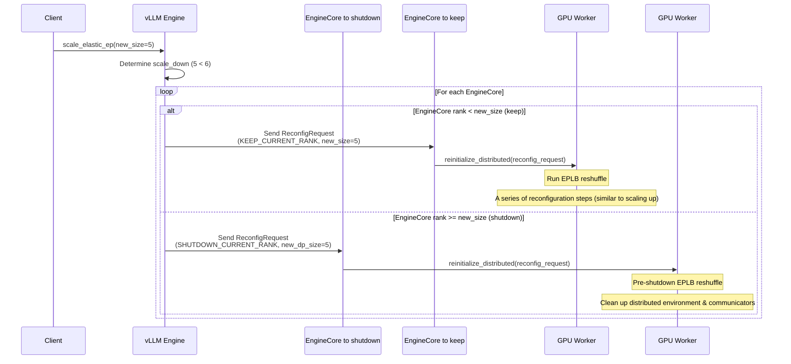

# Detailed Scale Down Sequence Diagram

This diagram shows the detailed process of scaling down the elastic EP (Expert Parallel) system, including distributed environment cleanup, expert weight consolidation, and engine shutdown.

## Key Scale Down Processes

### 1. **Pre-Scale EPLB Processing**
- Collect expert load statistics from all engines
- Calculate optimal distribution for remaining engines
- Prepare for expert weight consolidation

### 2. **Engine Classification**
- **Keep Engines**: Engines with rank < new_size
  - Receive KEEP_CURRENT_RANK reconfig request
  - Participate in expert weight consolidation
  - Continue operation with new configuration
- **Shutdown Engines**: Engines with rank >= new_size
  - Receive SHUTDOWN_CURRENT_RANK reconfig request
  - Transfer expert weights to remaining engines
  - Clean up and exit

### 3. **Expert Weight Consolidation**
- Calculate new expert mappings for reduced engine count
- Create rank mapping for remaining engines
- Transfer expert weights from shutdown engines to remaining engines
- Update physical-to-logical expert mappings
- Redistribute expert load across remaining engines

### 4. **Distributed Environment Cleanup**
- Destroy old process groups
- Update parallel configuration for reduced size
- Reinitialize distributed environment with new topology
- Create new process groups for remaining engines

### 5. **Engine Shutdown and Cleanup**
- Remove shutdown engines from core_engines list
- Terminate excess engine processes via Ray
- Clean up resources and exit processes
- Update configuration and stat loggers

## Critical Considerations

### **Data Preservation**
- Expert weights must be transferred before engine shutdown
- No data loss during consolidation process
- Maintain model integrity throughout scale down

### **Load Balancing**
- Redistribute expert load evenly across remaining engines
- Optimize for new topology and engine count
- Maintain performance characteristics

### **Coordination**
- Synchronize expert weight transfers
- Ensure all engines complete reconfiguration before shutdown
- Maintain distributed system consistency
