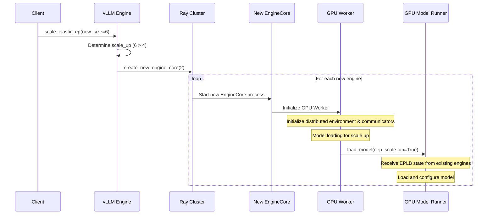

# Detailed Scale Up Sequence Diagram

This diagram shows the detailed process of scaling up the elastic EP (Expert Parallel) system, including distributed environment setup, weight loading, and expert rebalancing.

## Key Scale Up Processes

### 1. **Pre-Scale EPLB Processing**
- Collect expert load statistics from existing engines
- Calculate global expert load distribution
- Prepare for expert weight redistribution

### 2. **Distributed Environment Reconfiguration**
- Clean up old process groups
- Update parallel configuration (DP size, master IP/port)
- Reinitialize distributed environment with new size
- Create new process groups for all ranks

### 3. **Expert Weight Redistribution**
- Calculate new expert mappings using load balancing algorithm
- Redistribute expert weights across all ranks
- Update physical-to-logical expert mappings
- Ensure load balancing across new engine count

### 4. **New Engine Initialization**
- Create new engine processes via Ray
- Initialize distributed environment for new engines
- Load model with EPLB state from existing engines
- Configure expert weights and mappings

### 5. **Coordination and Cleanup**
- Wait for all reconfigurations to complete
- Notify coordinator about scale up
- Update configuration and stat loggers

