# DP Coordination During Elastic EP Scaling

This diagram shows how the DPCoordinator manages engine state, load balancing, and request waves during elastic EP (Expert Parallel) scaling operations.

```mermaid
sequenceDiagram
    participant Client as HTTP Client
    participant API as API Server
    participant CoreClient as DPLBAsyncMPClient
    participant Coordinator as DPCoordinator
    participant StatsTask as Stats Update Task
    participant Engine0 as Engine Rank 0
    participant Engine1 as Engine Rank 1
    participant Engine2 as Engine Rank 2
    participant Engine3 as Engine Rank 3
    participant Ray as Ray Cluster

    Note over Client, Ray: DP Coordination During Elastic EP Scaling

    Note over Client, Ray: Initial State (2 Engines)
    Coordinator->>Coordinator: Initialize with engine_count=2
    Coordinator->>Coordinator: engines = [EngineState(), EngineState()]
    Coordinator->>Coordinator: current_wave = 0, engines_running = False

    Note over Client, Ray: Scale Up Request
    Client->>API: POST /scale_elastic_ep<br/>{new_data_parallel_size: 4}
    API->>CoreClient: scale_elastic_ep(4)
    
    Note over CoreClient: Phase 1: Send reconfig messages
    loop For each existing engine
        CoreClient->>Engine0: ReconfigureDistributedRequest<br/>(KEEP_CURRENT_RANK)
        CoreClient->>Engine1: ReconfigureDistributedRequest<br/>(KEEP_CURRENT_RANK)
    end

    Note over CoreClient: Phase 2: Create new engines
    CoreClient->>Ray: scale_up_elastic_ep(4)
    Ray->>Engine2: Create new engine
    Ray->>Engine3: Create new engine
    
    Engine2->>Coordinator: Send ready message
    Engine3->>Coordinator: Send ready message

    Note over CoreClient: Phase 3: Notify coordinator about scale up
    CoreClient->>StatsTask: Send SCALE_ELASTIC_EP notification
    StatsTask->>Coordinator: ("SCALE_ELASTIC_EP", 4)
    
    Note over Coordinator: Handle scale up notification
    Coordinator->>Coordinator: new_engine_count = 4
    Coordinator->>Coordinator: current_count = 2
    Coordinator->>Coordinator: Add 2 new EngineState() objects
    Coordinator->>Coordinator: engines_running = False
    Coordinator->>Coordinator: Log: "DPCoordinator scaled up from 2 to 4 engines"

    Note over Client, Ray: Request Processing During Scaling

    Client->>API: POST /v1/chat/completions (during scaling)
    API->>CoreClient: Process request
    
    Note over CoreClient: Check if engines are running
    CoreClient->>CoreClient: Check engines_running flag
    
    alt Engines not running
        Note over CoreClient: Send FIRST_REQ notification
        CoreClient->>StatsTask: Send ("FIRST_REQ", target_engine_index)
        StatsTask->>Coordinator: Forward notification
        Coordinator->>Coordinator: engines_running = True
        Coordinator->>Coordinator: Send START_DP_WAVE to all engines
    end

    Note over Client, Ray: Normal Request Processing After Scaling

    Client->>API: POST /v1/chat/completions
    API->>CoreClient: Process request
    CoreClient->>CoreClient: get_core_engine_for_request()
    
    Note over CoreClient: Load balancing logic
    CoreClient->>CoreClient: Check lb_engines for load balancing
    CoreClient->>CoreClient: Choose engine with minimum [waiting, running] counts
    CoreClient->>Engine0: Route request to chosen engine
    
    Engine0->>Engine0: Process request
    Engine0->>Coordinator: Send request counts [waiting, running]
    
    Note over Coordinator: Update engine state
    Coordinator->>Coordinator: Update engines[0].request_counts
    Coordinator->>Coordinator: stats_changed = True
    
    Note over Coordinator: Publish stats to frontends
    Coordinator->>StatsTask: Publish updated stats
    StatsTask->>CoreClient: Update lb_engines with new counts
    CoreClient->>CoreClient: Update load balancing state

    Note over Client, Ray: Wave Management

    Note over Engine0: Request processing complete
    Engine0->>Engine0: Check if all requests finished
    Engine0->>Engine0: _has_global_unfinished_reqs() all-reduce
    
    alt All engines finished
        Engine0->>Coordinator: Send wave_complete notification
        Coordinator->>Coordinator: current_wave += 1
        Coordinator->>Coordinator: engines_running = False
        Coordinator->>Coordinator: stats_changed = True
        Coordinator->>StatsTask: Publish wave completion
    end

    Note over Client, Ray: Scale Down Request

    Client->>API: POST /scale_elastic_ep<br/>{new_data_parallel_size: 2}
    API->>CoreClient: scale_elastic_ep(2)
    
    Note over CoreClient: Phase 1: Send reconfig messages
    CoreClient->>Engine0: ReconfigureDistributedRequest<br/>(KEEP_CURRENT_RANK)
    CoreClient->>Engine1: ReconfigureDistributedRequest<br/>(KEEP_CURRENT_RANK)
    CoreClient->>Engine2: ReconfigureDistributedRequest<br/>(SHUTDOWN_CURRENT_RANK)
    CoreClient->>Engine3: ReconfigureDistributedRequest<br/>(SHUTDOWN_CURRENT_RANK)

    Note over CoreClient: Phase 2: Remove engines from core_engines
    CoreClient->>CoreClient: Remove engines with rank >= 2
    CoreClient->>CoreClient: core_engines = [engine0, engine1]

    Note over CoreClient: Phase 3: Notify coordinator about scale down
    CoreClient->>StatsTask: Send SCALE_ELASTIC_EP notification
    StatsTask->>Coordinator: ("SCALE_ELASTIC_EP", 2)
    
    Note over Coordinator: Handle scale down notification
    Coordinator->>Coordinator: new_engine_count = 2
    Coordinator->>Coordinator: engines = engines[:2]
    Coordinator->>Coordinator: Log: "DPCoordinator scaled down to 2 engines"

    Note over CoreClient: Phase 4: Shutdown excess engines
    CoreClient->>Ray: scale_down_elastic_ep(4, 2)
    Ray->>Engine2: Terminate engine
    Ray->>Engine3: Terminate engine

    Note over Client, Ray: Key DP Coordination Components

    Note over Coordinator: DPCoordinator Responsibilities
    Note over Coordinator: - Tracks engine state and request counts
    Note over Coordinator: - Manages request waves and running state
    Note over Coordinator: - Handles scale up/down notifications
    Note over Coordinator: - Publishes stats to frontends
    Note over Coordinator: - Coordinates engine synchronization

    Note over StatsTask: Stats Update Task
    Note over StatsTask: - Monitors coordinator for updates
    Note over StatsTask: - Forwards scale notifications
    Note over StatsTask: - Updates load balancing state
    Note over StatsTask: - Manages engine running state

    Note over CoreClient: Load Balancing
    Note over CoreClient: - Tracks request counts per engine
    Note over CoreClient: - Routes requests to least loaded engine
    Note over CoreClient: - Handles engine selection logic
    Note over CoreClient: - Manages request routing during scaling
```

## Key DP Coordination Mechanisms

### 1. **Engine State Tracking**
- **EngineState**: Tracks `[waiting, running]` request counts per engine
- **Current Wave**: Monitors global request wave number
- **Running State**: Tracks whether engines are actively processing requests

### 2. **Scale Up Coordination**
- **Notification**: CoreClient sends `("SCALE_ELASTIC_EP", new_count)` to coordinator
- **State Update**: Coordinator adds new `EngineState()` objects for new engines
- **Running State**: Sets `engines_running = False` to pause new requests during scaling
- **Logging**: Records scale up events for monitoring

### 3. **Scale Down Coordination**
- **Notification**: CoreClient sends scale down notification to coordinator
- **State Cleanup**: Coordinator removes excess engines from state tracking
- **Engine Shutdown**: Ray terminates excess engine processes
- **State Consistency**: Ensures coordinator state matches actual engine count

### 4. **Request Wave Management**
- **Wave Tracking**: Monitors global request wave progression
- **Synchronization**: Uses all-reduce operations to synchronize engine states
- **State Transitions**: Manages transitions between running and paused states
- **Race Condition Handling**: Handles stale wave requests and state inconsistencies

### 5. **Load Balancing Integration**
- **Stats Collection**: Coordinator collects request counts from all engines
- **Stats Publishing**: Publishes updated stats to frontend processes
- **Load Balancing**: Frontend uses stats for intelligent request routing
- **Dynamic Updates**: Load balancing state updates during scaling operations

### 6. **Request Processing Coordination**
- **First Request**: Special handling for requests when engines are paused
- **Wave Synchronization**: Ensures all engines progress through waves together
- **State Broadcasting**: Notifies all engines of state changes
- **Request Routing**: Intelligent routing based on current engine states

## Critical Coordination Points

### **During Scale Up**
1. **State Expansion**: Add new engine states to coordinator
2. **Running State**: Pause new requests during scaling
3. **Engine Registration**: New engines register with coordinator
4. **State Synchronization**: Ensure all engines have consistent state

### **During Scale Down**
1. **State Cleanup**: Remove excess engines from coordinator state
2. **Engine Shutdown**: Terminate excess engine processes
3. **Load Redistribution**: Redistribute load across remaining engines
4. **State Consistency**: Maintain consistent coordinator state

### **Request Processing**
1. **Load Balancing**: Route requests based on current engine states
2. **Wave Management**: Synchronize request processing across engines
3. **State Updates**: Continuously update engine states and load balancing
4. **Coordination**: Ensure proper coordination between all components

