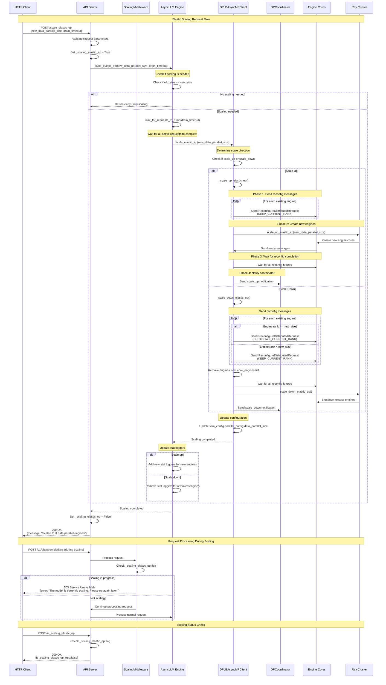

# Elastic Scaling Sequence Diagram

This diagram shows the sequence of interactions for the elastic scaling functionality in vLLM, based on the current PR changes.

## Key Changes in This PR

1. **Unified Scaling API**: The PR consolidates `scale_up_elastic_ep` and `scale_down_elastic_ep` into a single `scale_elastic_ep` method that automatically determines the scaling direction.

2. **Simplified AsyncLLM Logic**: Removed the `scaling` flag from AsyncLLM and simplified the scaling logic by delegating the direction determination to the CoreClient.

3. **Improved Error Handling**: Better handling of edge cases like when the new size equals the current size.

4. **Cleaner Code Structure**: The scaling logic is now more maintainable with clear separation of concerns between AsyncLLM and CoreClient.

5. **Middleware Integration**: The ScalingMiddleware ensures that requests are properly handled during scaling operations by returning 503 responses.

## Components Involved

- **API Server**: Handles HTTP requests and manages the global scaling state
- **ScalingMiddleware**: Prevents new requests during scaling operations
- **AsyncLLM**: High-level orchestration of the scaling process
- **DPLBAsyncMPClient**: Handles the actual scaling logic and engine management
- **DPCoordinator**: Manages distributed engine coordination
- **Ray Cluster**: Provides the underlying distributed computing infrastructure
- **Engine Cores**: The actual inference engines that get scaled up/down
